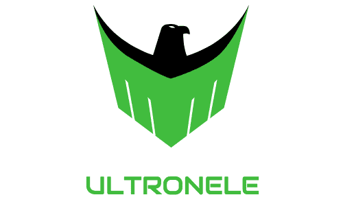

<p align="center">
  <a href="http://ultronele.com">
    
  </a>
</p>
<h1 align="center">
  The world’s fastest LMS engine
</h1>

This is a gatsby starter project used to generate a LMS(learning management system) skeleton site.

Logo image is designed in [designevo](https://www.designevo.com/)@2019/01/27


## Screen Shots


## Demo

is [HERE!](https://ultronele.netlify.com/)


## Features

* extremely smooth visit experience
* fast setup and easy depolyment procedure
* gamefication learning experience
* category/tutorial/quiz generation by cli easily
* learning process tracking and visualization
* quiz report and certificate generation
* user locally login/cache support
* mobile screen support


## Prerequisite tools

* node
* npm
* gatsby


## Important 3rd part library used

* [konva](https://konvajs.org/) to draw certificate 
* [react-confetti](https://github.com/alampros/react-confetti) to open bonus
* [downloadjs](http://danml.com/download.html) to convert dataURL to image file
* [plop](https://github.com/amwmedia/plop) to generate content by cli


## 🚀 Quick start

Just for a couple of commands, you will have your own LMS, here we go:

> $ gatsby new my-ultronele https://github.com/runbytech/ultron-ele

> $ cd my-ultronele

> $ npm i

> $ gatsby develop

Your site is now running at http://localhost:8000


## 🎓 Learning Gatsby

Looking for more guidance? Full documentation for UltronEle lives [on the website](https://ultronele.netlify.com/userguide). 


## 💫 Quick Deploy

```
Prerequisites: github account and netlify account required
```

[](https://app.netlify.com/start/deploy?repository=https://github.com/runbytech/ultron-ele)


## Contribution is Welcome

#### For the ReactJS developer

* fork this repository
* made your modifications or improvements
* request a PR
* notify me by email
* invite you to join collaborators

#### For the Content producer

* planning your courses that you want to be itegrated to this product permanently
* send your .pdf/.docx/images/videos to my email
* reorganize the content to the source file and publish
* give you credit by recording you to the contributer list


## Content structure by convention

    
    ├── content
      ├── assets
        ├── imagefoldera
        ├── imagefolderb
      ├── category
        ├── coursetypea
          ├── tutoriala
            ├── 1-section.md
            ├── 2-section.md
            ├── 3-section.md
            ├── x-section.md
            ├── test.md    # this file hold tutorial quiz questions
          ├── tutorialb
          ├── tutorialc
        ├── coursetypeb
        ├── coursetypec
      ├── pagea.md    # first level navigation page of your site
      ├── pageb.md
      ├── pagec.md
      ├── paged.md

