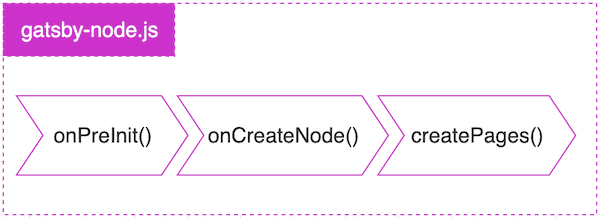
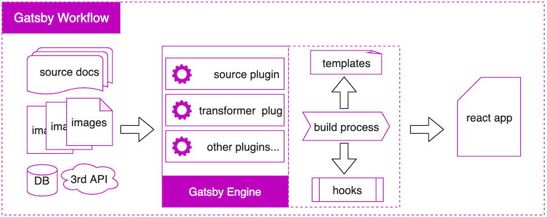
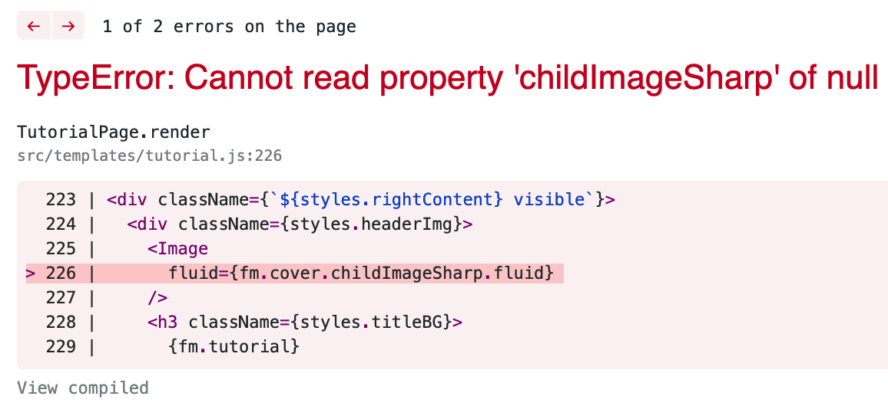

[](javascript:void(0))

As the one of the top static site generators, Gatsby have gained much momentum since last year. According to a recent  statistics [charts](#extread) show that the average downloads per week reach 200k around. Many web developers are attracted by its slogan: **`build blazing fast websites and apps`**, I am among them luckily. At the first impression, it may seems easy to start, but when you delve into it, things not like that.

<!-- end -->

### Why choose Gatsby

7 months ago, I was looking for a web development framework to build a new elearning product, the ideal candidate should meet this tech requirements:

* easy to get started
* no database dependency
* reactjs as front end
* markdown file as content source
* great performance while running
* scalability in customization dev
* lower cost for deployment
* no need content editor in backend

All this conditions together point to a final solution: a static CMS, then I found the StaticGen. Among the top 5 frameworks, Jekyll, Hugo, Hexo, are not unfamiliar to me. They all use markdown file as content source, but not reactjs tech stack. The first one Next.js, whereas, do not support rendering markdown file to html page by default. In the end, I choose Gatsby as my final dev platform for it meet almost all my requirements.


### How to design the project structure

We all know that how to create a reactjs application skeleton using **`create-react-app`**. Gatsby also has its cli tool **`gatsby`** to complete some tasks like project creation, start dev server, build project to production deployment and such. 

A typical [gatsby site structure](https://www.gatsbyjs.org/docs/gatsby-project-structure/) created by **`$ gatsby new my-gatsby-site`** may like this:


When you just treat it as a SSR(server side render) framework using reactjs, it's very similar to Next.js. But the truth is that the both are totally different. Actually, Gatsby doesn't render page while request received, it use **`render at build time`** approach to output static html content already transformed in build phase. Another difference between the two framework is that:

> Gatsby using markdown, json, csv, yaml file, even database as content source. Combined with GraphQL, those contents are mapped to template component and then rendered into static web application.

This is how the Gatsby works in nature, it's more like an engine, leveraging various kinds of plugin to transform different data source to unified data format which can be fetched by GraphQL query, you developer just write template page and GraphQL sentence to display your dynamic content.

Then, back to our project structure, how do we reorganize project so as to let Gatsby render our content file to browser? That's the **`magical part`** which make Gatsby unique to other frameworks.

Take the first Gatsby official starter project [gatsby-starter-blog](https://github.com/gatsbyjs/gatsby-starter-blog) for example, we use **`gatsby new`** command to clone a gatsby-starter-blog into my-blog-starter directory:

```
# create a new Gatsby site using the blog starter
$ gatsby new my-blog-starter https://github.com/gatsbyjs/gatsby-starter-blog
```

The newly created my-blog-starter project ends up a directory structure like this:


The top red rectangle outlines the **`content`** directory which contains blog post content in markdown format(.md) and images referenced in post. This is an additional directory not included in the previous my-gatsby-site structure. Besides, **`templates`** directory is also a new directory which contains the post template component in charge of fetching markdown file content through GraphQL to reactjs components.

> Put content directory in the project root is a good practice in Gatsby project, as well as templates directory under src directory.

Other good practices in planning project structure may include putting **`hooks`** and **`style`** directory under src directory, hooks contains all the hook components, and style contains all the css module file separated from those template and page components. My preferred **`src`** structure may like this:

    
    ├── src
      ├── components
      ├── hooks
      ├── pages
      ├── stye
      ├── templates
      ├── utils


Official Gatsby Project Structure document is [here](https://www.gatsbyjs.org/docs/gatsby-project-structure/)


### How's the Gatsby dev workflow look like

In the my-blog-starter project, we saw the content .md file and the blog-post.js template. Then, who does the combination task and how does it works? The anwser is in **`gatsby-node.js`**.

> Basically, gatsby-node.js file act as an assembling factory, it first transform content source into node model, then create page components with template and context parameters originated from node object.

Official document about the Gatsby build lifecycle is [here](https://www.gatsbyjs.org/docs/gatsby-lifecycle-apis/), also the must read [Behind the Scenes with Gatsby Internals](https://www.gatsbyjs.org/docs/gatsby-internals/), gives developer a thorough description of the internal work mechanism.

Here, I would like to summarize the process into a simple graph:



While developing Gatsby applications, we must understand 2 important config files first: **`gatsby-config.js`** and **`gatsby-node.js`**. One is for website metadata definition and plugins reference, another is for build process callback functions implementation.

That are the major difference from the traditional web development. In traditional web development workflow, we start web server, read application related config such as port number, DB access account and other global parameters, then expose service to client request. But in Gatsby, we don't run service in server, we create content in build time through plugins and callback functions, then deliver them to CDN. 

Simply put, Gatsby workflow can be outlined in such a diagram:



Then, our routine iteration development work may start with preparation work which may include writing config file and page templates, as well as content source, then implement callback functions in gatsby-node.js, last run **`$ gasby develop`** to see the result.

Among that files, the large amount of time will be taken by template component development. you need to implement UI, interactive logic, write GraphQL sentence in **`graphql explorer`** to test the data you want to display, then copy those query sentence and paste into template component for later build use. The template component is like a glue to connect data source and UI layer.

Wait, what if the data is not in file but in DB or 3rd part system? The anwser is using the existing gatsby plugin or developing your own gatsby plugins.

So, to work with Gatsby, you must think in a Gatsby way, just as the above diagram described:

* using **`Plugin`** to fetch and convert source data to the Gatsby known data model 
* using **`Graphql`** to query UI/template needed data from Gatsby
* using build **`Hooks`**(callback functions) to generate html content from template components.


### What changes does it take to the front devs

Web framework emerging endless, but excellent framework is so rare. In numerous JAMstack solutions, I believe that Gatsby is the most distinctive and innovative. Gatsby claims that it can build website with a blazing fast user experience, Lighthouse test in its [official document](https://www.gatsbyjs.org/docs/audit-with-lighthouse/) proved their statement. How did they make it? 

[The idea](https://www.gatsbyjs.org/docs/gatsby-core-philosophy/) behind the product and [the architecture pattern](https://www.gatsbyjs.org/docs/prpl-pattern/) they are following ensure its high performance. 

For a normal developer, this may mean a lot when you want to develop a prototype web application, deliver user a great user experience without taking pain to tune it little by little, furthermore, you don't have much money to purchase database service and web server.

Take my first Gatsby project [UltronEle](http://ultronele.com) for example, I toke near 3 months(60~70 workdays) development time to implement the first version of a feature rich elearning product. All my dev time spent in business logic and interactive logic implementation, no need to process database, no need to deploy a server in release environment. This make my product very light, and cost efficient.

Without Gatsby framework, I doubt if my product would be born so soon. Although the initial exploration phase in Gatsby felt a little confusion, but the whole development experience was so cool.

Gatsby's popularity may predict a better internet, the next generation of internet technology, with high speed display, excellent user experience, light weight deployment, lower cost to develop and use. This change would bring web developers and IT service sector plenty of potential opportunities. 


### Are there any pits still exist

By the time of this post written, unfortunately, there still exist one annoying bug in Gatsby v2.3.27. That's the historic error  statement: **`TypeError: Cannot read property 'childImageSharp' of null`**.

]

This confused me for a long time, occasionally it popped up and gave you an accidental surprise. It was reported early in issue [#2567](https://github.com/gatsbyjs/gatsby/issues/2567) on Oct 21, 2017. The solution for that issue ended up with  removing **`.cache`** folder. So, each time the error jumped out, I would first stop server by **`ctrl+c`** then execute the following command and refresh page to get it back:

```
# in Mac OSX enviroment:
$ rm -rf .cache && gatsby develop
```

This really works, and is the only approach to eliminate the error so far. The negative impact of this bug to my product is that each time I create tutorial content with generator I must stop server first then create tutorial last execute the command above, lead to a broken user experience.


### What's the best practice to persuade clients to use it

From a marketing view, how to sell your Gatsby solution to the best fit clients may be a top priority of concern. This topic has a few of articles discussed in [How to Talk about Gatsby to Clients and Your Team](https://www.gatsbyjs.org/blog/2019-03-07-sell-gatsby-to-clients/) and [How To Recognize When Gatsby is a Good Fit for Your Client](https://www.gatsbyjs.org/blog/2019-06-10-how-to-recognize-when-gatsby-is-a-good-fit-for-your-client/), as well as the Gatsby advantages explanation in [one page](https://www.gatsbyjs.org/gatsby-one-pager.pdf) from its official site.

The internet world by nature consists of a variety of content, text, image, music, video... To push the boundary of distribution for these media content, as well as web resources html, javascript, css, Gatsby was designed to leverge the most advanced web technologies and the most smart design pattern, also referenced the good practice of other CMS framework: [themeization](https://www.gatsbyjs.org/blog/2019-07-03-announcing-stable-release-gatsby-themes/) to make it more adaptable, reusable, customizable. Then, when you face your potential clients, how could you persuade your clients willing to invest such a technical upgrade, to bear the risk of system transition, and believe the return on investment?

Apart from those How tos, I summarized the following viewpoints to improve the Gatsby adoption in clients business:

* leveraging the legacy system content or data by plugin extraction
* resolve the performance bottle neck problem through a Gatsby way
* start with the internal project, minor functionality unit
* introduce to reactjs stack based development team
* progressively adoption and migration little by little
* aim to clients who want to use cloud service and to cut cost in IT infrastructure


This is a short idea list I can think of currently about traditional web system migration to Gatsby. With more and more projects I involved, I believe this list will continue grow.  Web technology is evolving constantly with fun and efficiency, that's how Gatsby comes, let's make it clear and lead a better life in partnership with Gatsby.